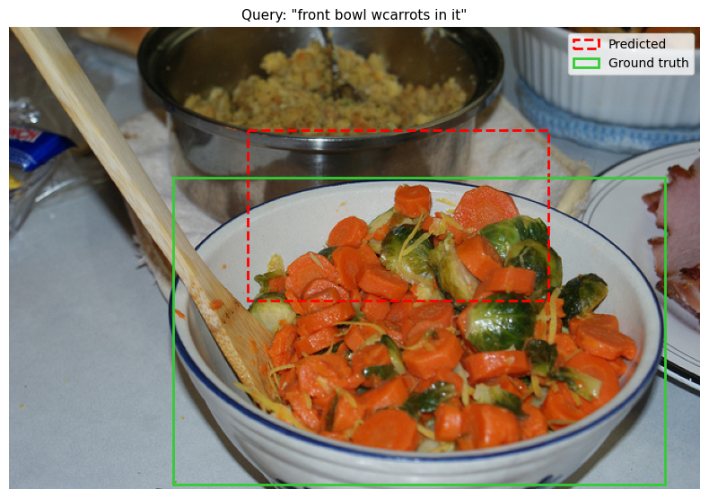
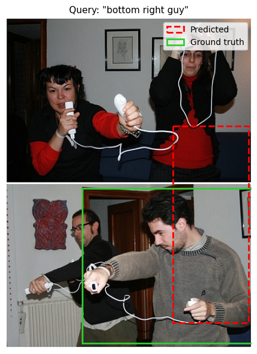
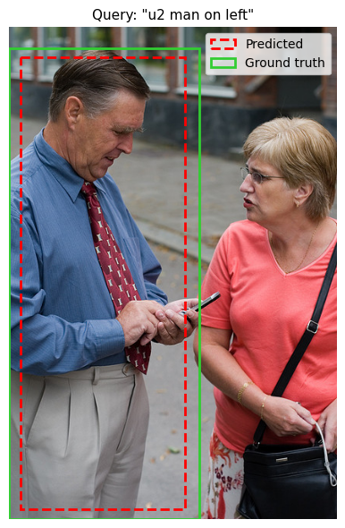
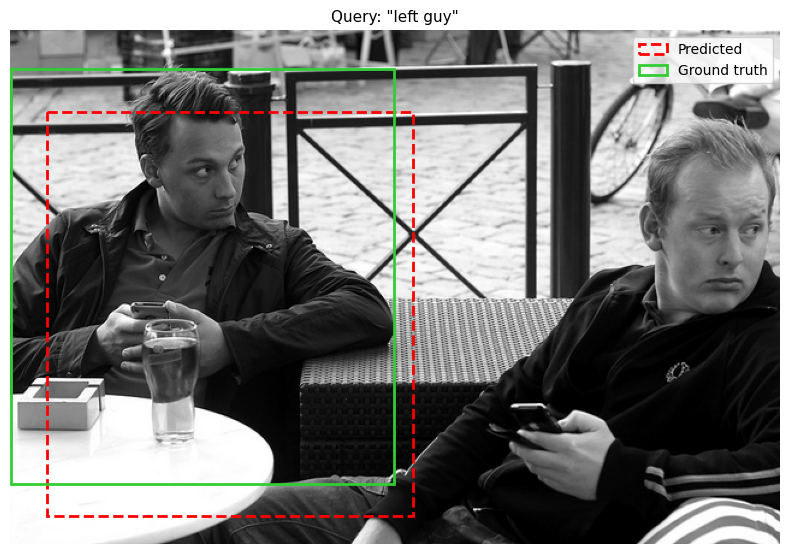

# ClipDetector

Open-vocabulary detection uses pre-trained CLIP (ViT-B/16) language-text aligned embeddings, combined with a custom MLP regression head to predict normalized bounding boxes [x1, y1, x2, y2] from natural language queries and images.

Examples:

 
 